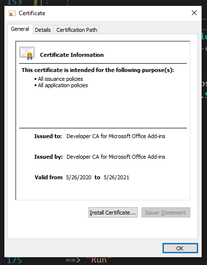
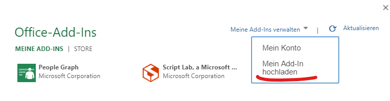

# Swate

> **Swate** - something or someone that gets you absolutely joyed ([Urban dictionary](https://www.urbandictionary.com/define.php?term=swate))

**Swate** is a **S**wate **W**orkflow **A**nnotation **T**ool for **E**xcel.

Swate aims to provide a low-friction workflow annotation experience that makes the usage of controlled vocabularies (ontologies) as easy and intuitive as possible. It is designed to integrate in the familiar spreadsheet environment that is the center of a great deal of data-focused wetlab work.


<!-- TOC -->

- [Swate](#swate)
  - [Features](#features)
  - [Install/Use](#installuse)
    - [Excel desktop](#excel-desktop)
      - [Using the Swate Installer](#using-the-swate-installer)
      - [Using a shared folder](#using-a-shared-folder)
    - [Excel online](#excel-online)
  - [Discuss/Get help](#discussget-help)
    - [Documentation](#documentation)
      - [API docs](#api-docs)
      - [Feature documentation](#feature-documentation)
      - [Guides](#guides)
    - [Report problems and request features](#report-problems-and-request-features)
    - [(Beta) Discuss in the GitHub Discussion forum](#beta-discuss-in-the-github-discussion-forum)
  - [Develop](#develop)
    - [Contribute](#contribute)
    - [Prerequisites](#prerequisites)
    - [Use install.cmd](#use-installcmd)
    - [Set up Sql Dump](#set-up-sql-dump)
    - [Project Decription](#project-decription)

<!-- /TOC -->

## Features

The base features of Swate are:

- **Gradual workflow annotation table building** via the [basic annotation building blocks](https://nfdi4plants.github.io/AnnotationPrinciples/)
- No-fuss **ontology term search**:
    - search for ontology terms quickly via autocomplete
    - use is-a **relational term search** (e.g. search all terms that are also a 'plant organ') to constrain your annotation column to a subset of ontologies
    - use **Advanced term search** with multiple query parameters if quick search does not do it for you

There are many more small and incremental features. Check the [latest release notes](https://github.com/nfdi4plants/Swate/releases) for the newest additions.


## Install/Use

You can test swate by following the steps below. If you decide to do so, please take the time to set up a Github account to report your issues and suggestions [here](https://github.com/nfdi4plants/Swate/issues).
You can also search existing issues for solutions for your questions and/or discussions about your suggestions.

___N O T E___ : Swate runs **only** on MS Excel 365, and MS Excel Online. We test on and develop for explicitly these versions. (It is possible though that some older versions like MS Excel 2019 work.)

### Excel desktop


#### Using the Swate installer
Use the new [Swate installer](https://github.com/omaus/Swate_Install#swate-installer).

<details>
    <summary>Alternative | Using the release archive</summary>
    
    #### Using the release archive
    
    - Install [node.js LTS](https://nodejs.org/en/) (needed for office addin related tooling)
    - Download the [latest test release archive](https://github.com/nfdi4plants/Swate/releases) and extract it
    - Execute the test.cmd (windows, as administrator) or test.sh (macOS, you will need to make it executable via chmod 
    a+x) script.
  
</details>

#### Using a shared folder 

If you have administrative access in your organization, you can create a network share folder and follow [this guide](https://github.com/OfficeDev/office-js-docs-pr/blob/master/docs/testing/create-a-network-shared-folder-catalog-for-task-pane-and-content-add-ins.md#:~:text=Sideload%20your%20add%2Din,-Put%20the%20manifest&text=Be%20sure%20to%20specify%20the,element%20of%20the%20manifest%20file.&text=In%20Excel%2C%20Word%2C%20or%20PowerPoint,Office%20Add%2Dins%20dialog%20box.) to make the addin available without any further downloads from your users

### Excel online

- Download the [latest test release archive](https://github.com/nfdi4plants/Swate/releases) and extract it
- Launch [Excel Online](https://office.live.com/start/Excel.aspx) (this requires a Microsoft account), open a (blank) workbook 
- Under the `Insert` tab, select `Add-Ins`
- Go to `Manage my Add-Ins` and select `Upload my Add-In`
- select and upload the `manifest.xml` file contained in the test release archive.

## Discuss/Get help

### Documentation

#### API docs 

The RPC API docs of Swate are available [here](https://swate.denbi.uni-tuebingen.de/api/IAnnotatorAPIv1/docs)

#### Feature documentation

Documentation of the features is now a top priority as we completed the POC stage :rocket:. You can discuss needed docs and the available ones [here](https://github.com/nfdi4plants/Swate/issues/47)

#### Guides

Guides will be coming in the near future.

### Report problems and request features

Please use [Github issues](https://github.com/nfdi4plants/Swate/issues/new/choose) to track problems, feature requests, questions, and discussions. Additionally, you can get in touch with us on [Twitter](https://twitter.com/nfdi4plants)

### (Beta) Discuss in the GitHub Discussion forum

GitHub recently added forum-like features to repositories, which makes it possible to discuss and share things you do with swate without creating issues. You are very welcome to post content [in the `Discussions` tab](), but please use issues for bug reports/feature requests (or, if some of those result from a discussion, create a new issue referencing the discussion)

## Develop

### Contribute
Starting at [Prerequisites](#prerequisites) we will explain the set up, but please read the following first.
Before you contribute to the project remember to return all placeholders to your project:

-   webpack.config.js    
    ```
    https: {
        key: "{USERFOLDER}/.office-addin-dev-certs/localhost.key",
        cert: "{USERFOLDER}/.office-addin-dev-certs/localhost.crt",
        ca: "{USERFOLDER}/.office-addin-dev-certs/ca.crt"
    },
    ```
-   .db/docker-compose.yml
    ```
    MYSQL_ROOT_PASSWORD: {PASSWORD}
    ```
-   Server/dev.json
    ```
    "Swate:ConnectionString": "server=127.0.0.1;user id=root;password={PASSWORD}; port=42333;database=SwateDB;allowuservariables=True;persistsecurityinfo=True"
    ```

### Prerequisites

 - .NET Core SDK at of at least the version in [the global.json file](global.json)
 - Docker with Docker-compose
 - Node.js with npm/npx
 - To setup all dev dependencies, you can run the following commands or the install.cmd file (explained further below). The first run will take some time to import the database from the .sql file:

    `dotnet tool restore` (to restore local dotnet tools)

    `dotnet fake build -t setup pw:example`, which will take care of installing necessary certificates and loopback exempts for your browser. Here are the steps if you want to execute them by yourself:

    - 'pw:example' is an optional parameter for the setup target to use a custom password for the local MySql docker instance. If this argument is not passed the instance will be created with the password 'example'.

    - connections from excel to localhost need to be via https, so you need a certificate and trust it. [office-addin-dev-certs](https://www.npmjs.com/package/office-addin-dev-certs?activeTab=versions) does that for you.

        you can also use the fake build target for certificate creation and installation by using `dotnet fake build -t createdevcerts` in the project root (after restoring tools via `dotnet tool restore`).

        This will use office-addin-dev-certs to create the necessary certificates, and open the installation dialogue for you:

        

        installing this ca certificate under your trusted root certification authorities will enable you to use https via localhost.

        The paths to these certificates are then added to your webpack.config file.

     - You may need a loopback exemption for Edge/IE (whatever is run in your excel version): 

        `CheckNetIsolation LoopbackExempt -a -n="microsoft.win32webviewhost_cw5n1h2txyewy"`

### Use install.cmd

The install.cmd executes several console commands for one of which it needs adminstratorial rights (dotnet fake build -t setup) to install the certificate mentioned above.
Open powershell as adminstrator and navigate to the Swate-folder ```cd your\folder\path\Swate``` then use ```.\install.cmd``` to initialize the setup.
While running a installation dialogue for the certificate will open and can be handled as described above.

By installing this repo via the install.cmd file the MySql password will default to 'example'.

### Set up Sql Dump

The database became too large for GitHub to upload the dump directly. Therefore we now provide the basic Database structure as .sql dump file in this repo, including the data for ontologiesand all template related tables. Only Terms and TermRelationships are missing. These tables can be populated via the private repository SwateDB (v2 branch). If you can't access this repository, please post an issue and you will get a complete dump.

The following instructions can help to import that dump into the database:

After following the instructions above:
1. Open powershell in the folder with the sql dump. 
2. Use `cmd /c "docker exec -i db_db_1 mysql -uroot -pexample SwateDB<SwateDB.sql"`
3. Observe in Adminer how the tables are created and slowly filled.

### Project Decription

This project uses the [SAFE Stack](https://github.com/SAFE-Stack) to create a website that uses [office.js](https://github.com/OfficeDev/office-js) to interop with Excel.

The file [OfficeJS.fs](src/Client/OfficeJS.fs) contains Fable bindings autogenerated from the office.js typescript definitions.

to debug the AddIn locally, use the build target `OfficeDebug`:

`fake build -t OfficeDebug`

this will launch an Excel instance with the AddIn sideloaded, while also running docker with a MySql- and a Adminer instance.
The MySql user/password will be root/example and can be set in .db/docker-compose.yml.
Adminer can be accessed at localhost:8085, MySql at localhost:42333, and the app runs at localhost:3000 for client and localhost:8080 for the server.

However it is currently pretty hard to attach a debugger to the instance of edge that runs in
the Excel window (update: you can now use [EdgeDevToolsPreview](https://www.microsoft.com/en-us/p/microsoft-edge-devtools-preview/9mzbfrmz0mnj?activetab=pivot:overviewtab) for that aswell). You can circumvent this issue by additionally testing in Excel online:

 - open Excel online in your favorite browser
 - create a blank new workbook (or use any workbook, but be warned that you can't undo stuff done via Office.js) 
 - Go to Insert > Office-Add-Ins and upload the manifest.xml file contained in this repo
    
 - You will now have the full debug experience in your browser dev tools.

Alternatively, you can debug all functionality that does not use Excel Interop in your normal browser (the app runs on port 3000 via https)

