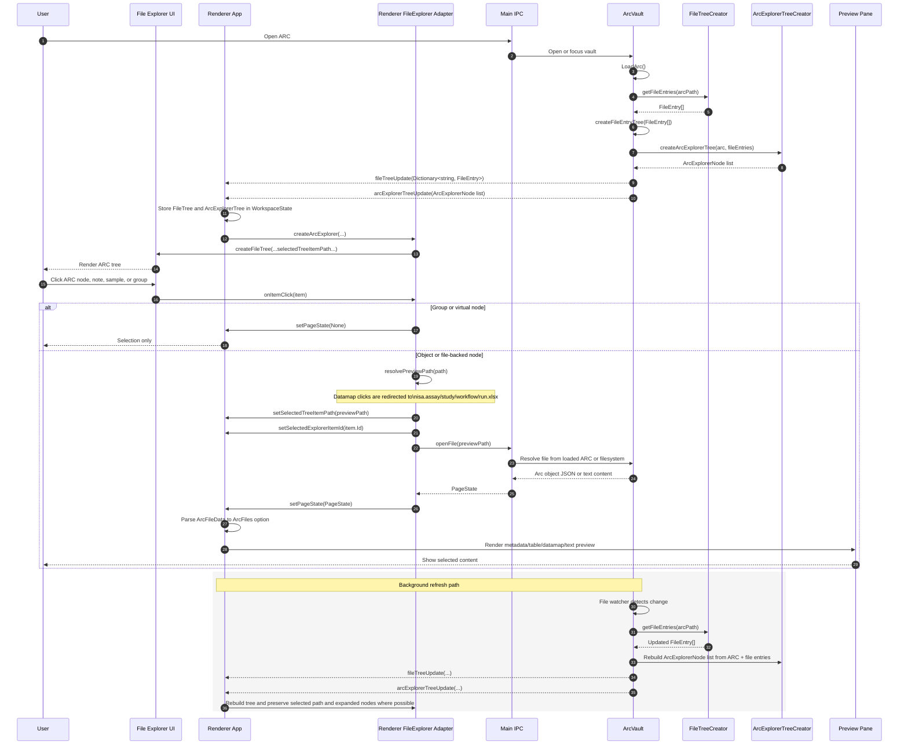

# File Explorer Architecture

This document describes the current explorer architecture in the Electron application.

The app now keeps two parallel models:

- A flat filesystem `FileEntry` list for note search, path-based helpers, and low-level file refreshes.
- An ARC object tree (`ArcExplorerNode list`) for the sidebar explorer.

## Sequence Diagram

## Main Pieces

- `src/Electron/src/Main/FileTreeCreator.fs`
  Scans the ARC directory, filters ignored paths, and annotates files with Git LFS tracking information.

- `src/Electron/src/Main/ArcVault.fs`
  Owns the loaded ARC, watches the filesystem, and pushes both file tree and ARC explorer updates to the renderer.

- `src/Electron/src/Main/ArcExplorerTreeCreator.fs`
  Builds the ARC object-based sidebar tree from `vault.arc` plus filesystem-derived notes.

- `src/Electron/src/Swate.Electron.Shared/FileIOTypes.fs`
  Defines the flat `FileEntry` transport type and the shared `ArcExplorerNode` contract used by the object tree.

- `src/Electron/src/Renderer/App.fs`
  Stores both `FileTree` and `ArcExplorerTree` in renderer workspace state and selects the sidebar item by explorer id or fallback path.

- `src/Electron/src/Renderer/Components/FileExplorer.fs`
  Adapts the shared ARC object tree into the reusable explorer component and maps object/file clicks to preview requests.

- `src/Components/src/FileExplorer/FileTreeDataStructures.fs`
  Contains the reusable file tree model, update logic, and helper operations.

- `src/Components/src/FileExplorer/FileExplorer.fs`
  Renders the generic file explorer UI, including selection, expansion, breadcrumbs, and context menu hooks.

- `src/Components/src/FileExplorer/FileExplorerBreadcrumbs.fs`
  Renders the breadcrumb trail for the selected tree node.

- `src/Components/src/FileExplorer/FileExplorerGitLfsHelper.fs`
  Builds Git LFS context menu actions and resolves repository-relative file paths.

## Notes

- The sidebar is ARC-object-first. Studies, assays, workflows, runs, notes, and samples are represented as domain nodes, not reconstructed from path segments in the renderer.
- Relationship edges are rendered as reference nodes:
  - `Study -> Assay`
  - `Workflow -> Subworkflow`
  - `Run -> Workflow`
- Notes remain filesystem-derived from `notes/...` paths.
- Samples are virtual nodes derived from ARC tables by collecting sample identifiers from `IOType.Sample` columns.
- Datamap file clicks are still resolved through the owning ISA object path before preview.
- The reusable explorer component is still application-agnostic; Electron-specific behavior remains in the renderer adapter.
