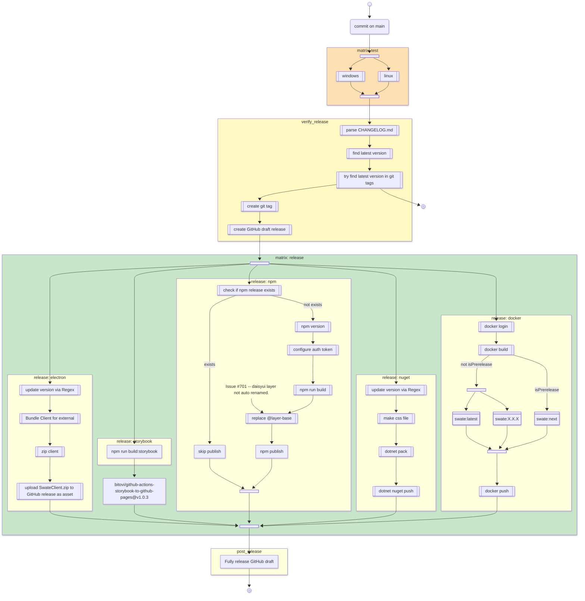

# Maintainer Documentation

## Release Workflow

```mermaid
---
config:
  look: neo
  layout: dagre
---
flowchart TD
 subgraph s1["matrix: test"]
        n6["windows"]
        n7["linux"]
        n10["Fork/Join"]
        n9["Fork/Join"]
  end
 subgraph s2["verify_release"]
        n4["parse CHANGELOG.md"]
        n11["find latest version"]
        n12["try find latest version in git tags"]
        n13["create git tag"]
        n14["create GitHub draft release"]
  end
 subgraph s4["release: nuget"]
        n17["update version via Regex"]
        n22["make css file"]
        n23["dotnet pack"]
        n24["dotnet nuget push"]
  end
 subgraph s5["release: docker"]
        n18["docker login"]
        n25["docker build"]
        n29["Fork/Join"]
        n26["swate:next"]
        n27["swate:latest<br>"]
        n28["swate:X.X.X<br>"]
        n30["Fork/Join"]
        n31["docker push"]
  end
 subgraph s6["release: storybook"]
        n19["npm run build:storybook"]
  end
 subgraph s7["release: electron"]
        n20["update version via Regex"]
        n32["Bundle Client for external"]
        n33["zip client"]
        n34["upload SwateClient.zip to GitHub release as asset"]
  end
 subgraph s8["release: npm"]
        n21["npm version"]
        n36["npm run build"]
        n37["configure auth token"]
        n38["check if npm release exists"]
        n39["skip publish"]
        n40["npm publish"]
        n42["Fork/Join"]
        n46["Issue #701 -- daisyui layer not auto renamed."]
        n45["replace @layer-base"]
  end
 subgraph s9["matrix: release"]
        s8
        s7
        s6
        s5
        s4
        n35@{ label: "<div style=\"color:\"><span style=\"color:\">bitovi/github-actions-storybook-to-github-pages@v1.0.3</span></div>" }
        n41["Fork/Join"]
        n16["Fork/Join"]
  end
 subgraph s10["post_release"]
        n43["Fully release GitHub draft"]
  end
    n2["Start"] --> n1["commit on main"]
    n1 --> n9
    n9 --> n7 & n6
    n6 --> n10
    n7 --> n10
    n10 --> n4
    n4 --> n11
    n11 --> n12
    n12 --> n8["Stop"] & n13
    n13 --> n14
    n14 --> n16
    n16 --> n18 & n19 & n17 & n20 & n38
    n17 --> n22
    n22 --> n23
    n23 --> n24
    n25 -- not isPrerelease --> n29
    n25 -- isPrerelease --> n26
    n29 --> n27 & n28
    n18 --> n25
    n27 --> n30
    n28 --> n30
    n26 --> n30
    n30 --> n31
    n20 --> n32
    n32 --> n33
    n33 --> n34
    n19 --> n35
    n38 -- exists --> n39
    n34 --> n41
    n35 --> n41
    n39 --> n42
    n40 --> n42
    n42 --> n41
    n24 --> n41
    n31 --> n41
    n41 --> n43
    n43 --> n44["Stop"]
    n46 --> n45
    n38 -- not exists --> n21
    n36 --> n45
    n45 --> n40
    n21 --> n37
    n37 --> n36
    n6@{ shape: subproc}
    n7@{ shape: subproc}
    n10@{ shape: fork}
    n9@{ shape: fork}
    n4@{ shape: subproc}
    n11@{ shape: subproc}
    n12@{ shape: subproc}
    n13@{ shape: subproc}
    n14@{ shape: subproc}
    n17@{ shape: subproc}
    n22@{ shape: subproc}
    n23@{ shape: subproc}
    n24@{ shape: subproc}
    n18@{ shape: subproc}
    n25@{ shape: subproc}
    n29@{ shape: fork}
    n26@{ shape: div-proc}
    n27@{ shape: div-proc}
    n28@{ shape: div-proc}
    n30@{ shape: fork}
    n31@{ shape: subproc}
    n19@{ shape: rect}
    n20@{ shape: subproc}
    n32@{ shape: subproc}
    n33@{ shape: subproc}
    n34@{ shape: subproc}
    n21@{ shape: subproc}
    n36@{ shape: subproc}
    n37@{ shape: subproc}
    n38@{ shape: subproc}
    n39@{ shape: proc}
    n40@{ shape: proc}
    n42@{ shape: fork}
    n46@{ shape: text}
    n45@{ shape: subproc}
    n35@{ shape: proc}
    n41@{ shape: fork}
    n16@{ shape: fork}
    n2@{ shape: start}
    n1@{ shape: event}
    n8@{ shape: stop}
    n44@{ shape: stop}
    style s9 fill:#C8E6C9
    style s2 fill:#FFF9C4
    style s1 fill:#FFE0B2

```