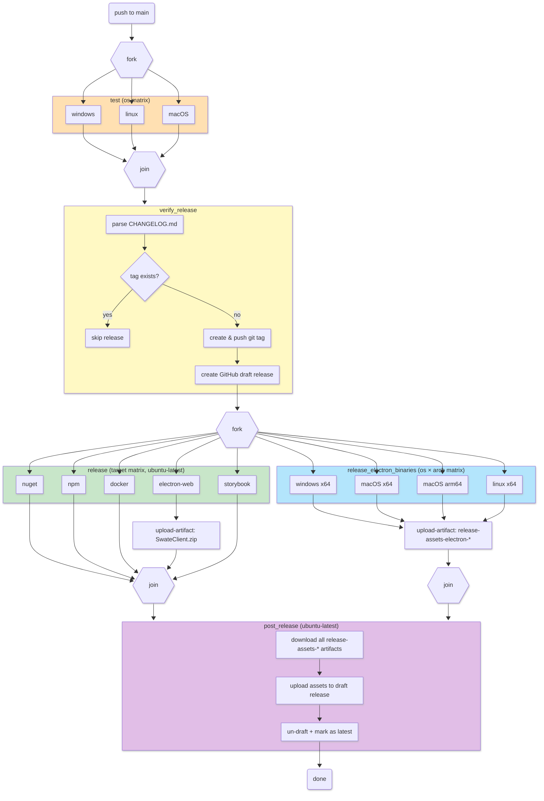
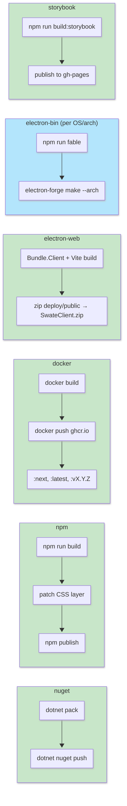

# Maintainer Documentation

## Release Workflow

### Pipeline Orchestration

Job dependencies, matrix fan-out/fan-in, and artifact flow for `release-pipeline.yml` on push to `main`.

### Release Target Details

What each target in the `release` matrix does internally.

> **Note:** `electron-web` builds the prebundled web client frontend, historically used as an iframe in an external Electron app. It is unrelated to the `electron-bin` target which builds the Swate desktop application via `electron-forge make`.
